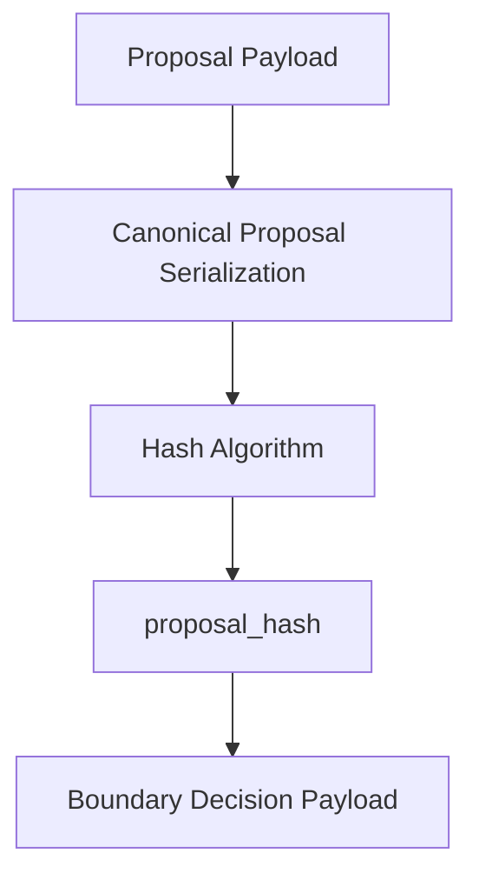
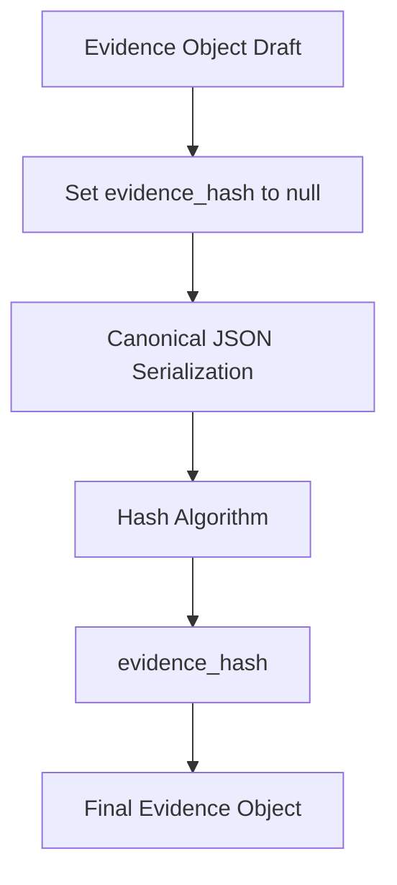
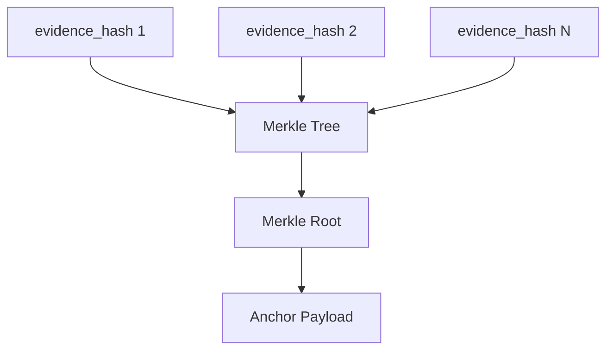
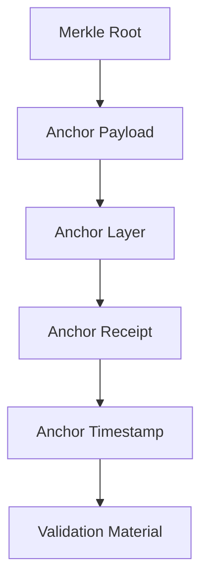

# Evidence Lifecycle Diagrams

## Proposal Hash Generation

```mermaid
flowchart TD
    A[Proposal Payload] --> B[Canonical Proposal Serialization]
    B --> C[Hash Algorithm]
    C --> D[proposal_hash]
    D --> E[Boundary Decision Payload]
```

## Evidence Hash Generation

```mermaid
flowchart TD
    A[Evidence Object Draft] --> B[Set evidence_hash to null]
    B --> C[Canonical JSON Serialization]
    C --> D[Hash Algorithm]
    D --> E[evidence_hash]
    E --> F[Final Evidence Object]
```

## Merkle Batching

```mermaid
flowchart TD
    A[evidence_hash 1] --> D[Merkle Tree]
    B[evidence_hash 2] --> D
    C[evidence_hash N] --> D
    D --> E[Merkle Root]
    E --> F[Anchor Payload]
```

## Anchor Emission

```mermaid
flowchart TD
    A[Merkle Root] --> B[Anchor Payload]
    B --> C[Anchor Layer]
    C --> D[Anchor Receipt]
    D --> E[Anchor Timestamp]
    E --> F[Validation Material]
```
