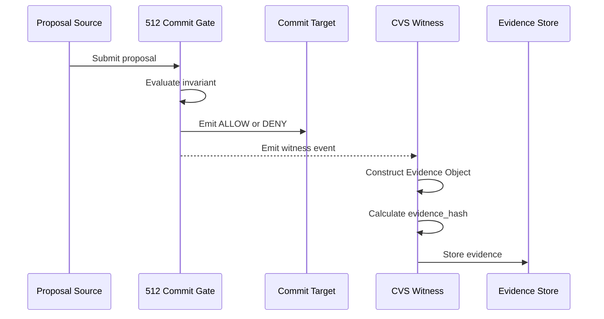
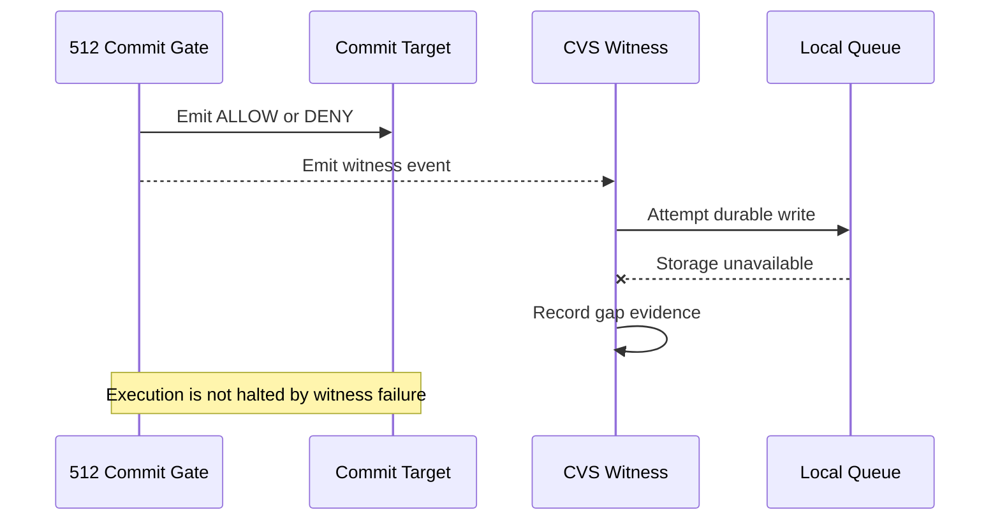
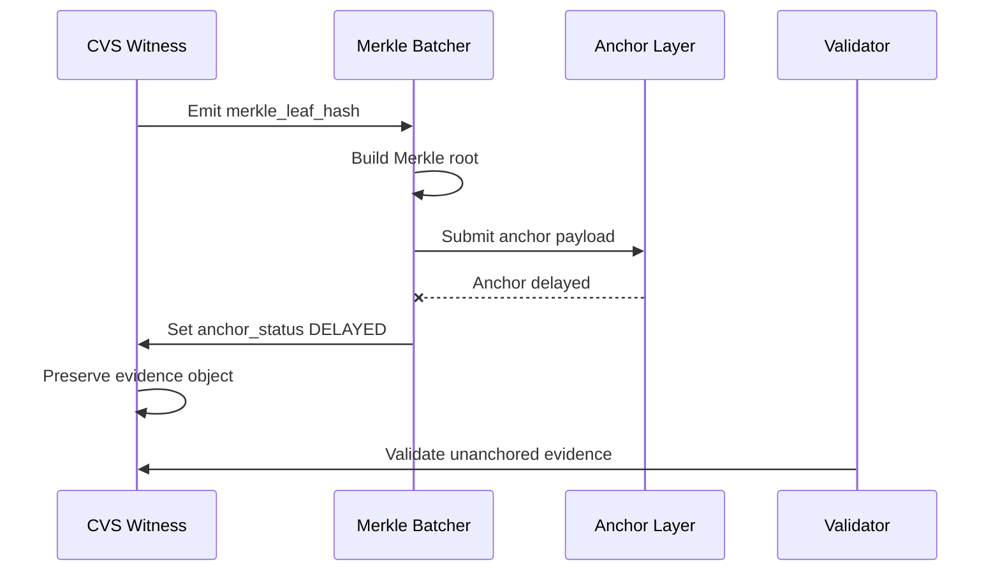

# Sequence Diagrams

## Proposal to Decision to Evidence

```mermaid
sequenceDiagram
    participant P as Proposal Source
    participant G as 512 Commit Gate
    participant C as Commit Target
    participant W as CVS Witness
    participant S as Evidence Store

    P->>G: Submit proposal
    G->>G: Evaluate invariant
    G->>C: Emit ALLOW or DENY
    G-->>W: Emit witness event
    W->>W: Construct Evidence Object
    W->>W: Calculate evidence_hash
    W->>S: Store evidence
```

## Fail-Open Gap Generation

```mermaid
sequenceDiagram
    participant G as 512 Commit Gate
    participant C as Commit Target
    participant W as CVS Witness
    participant Q as Local Queue

    G->>C: Emit ALLOW or DENY
    G-->>W: Emit witness event
    W->>Q: Attempt durable write
    Q--xW: Storage unavailable
    W->>W: Record gap evidence
    Note over G,C: Execution is not halted by witness failure
```

## Delayed Anchoring

```mermaid
sequenceDiagram
    participant W as CVS Witness
    participant M as Merkle Batcher
    participant A as Anchor Layer
    participant V as Validator

    W->>M: Emit merkle_leaf_hash
    M->>M: Build Merkle root
    M->>A: Submit anchor payload
    A--xM: Anchor delayed
    M->>W: Set anchor_status DELAYED
    W->>W: Preserve evidence object
    V->>W: Validate unanchored evidence
```
