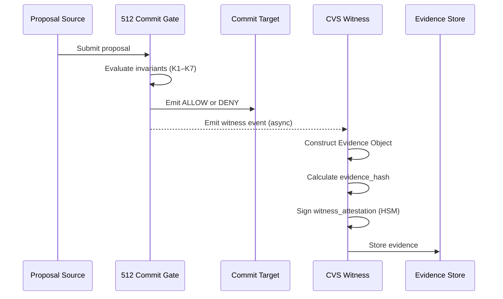
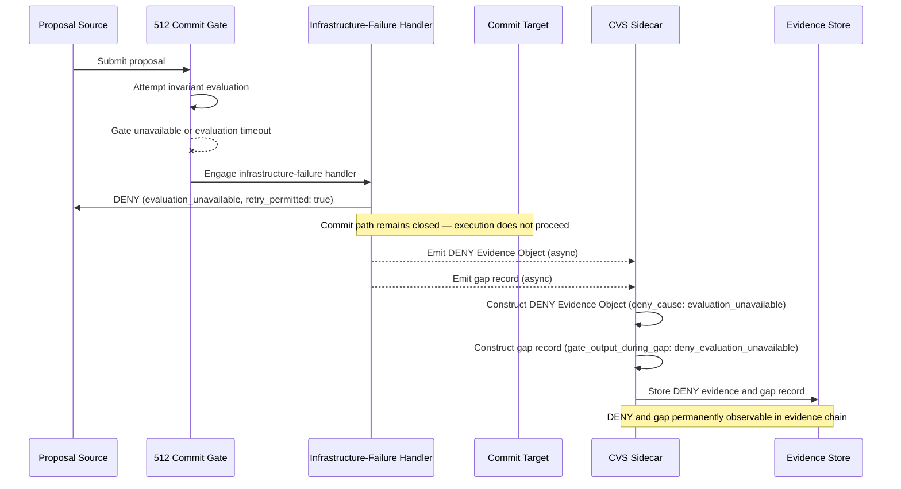
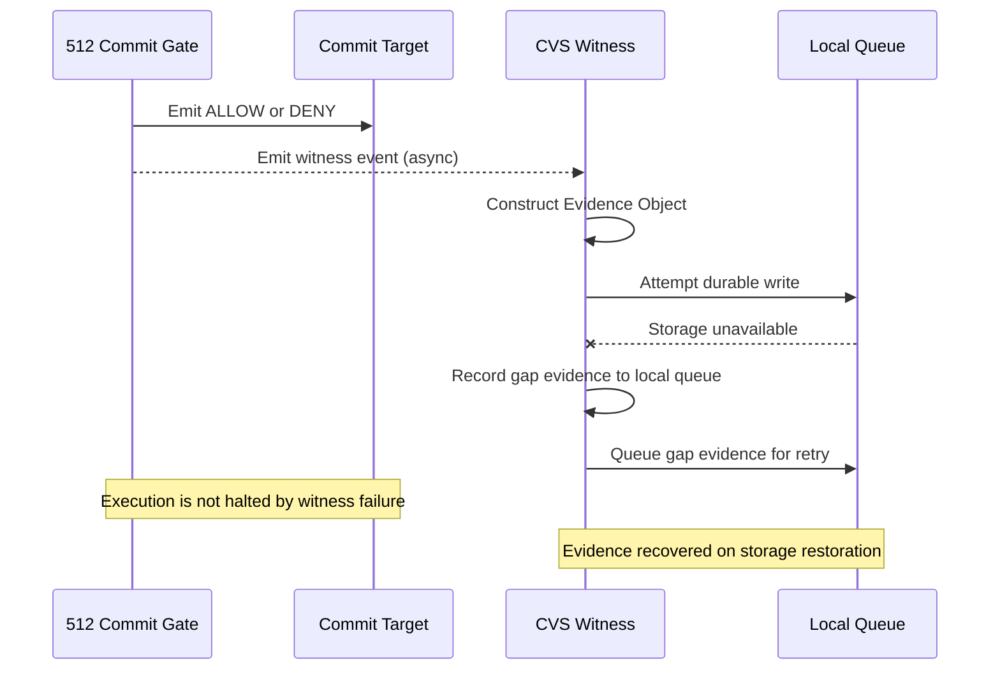
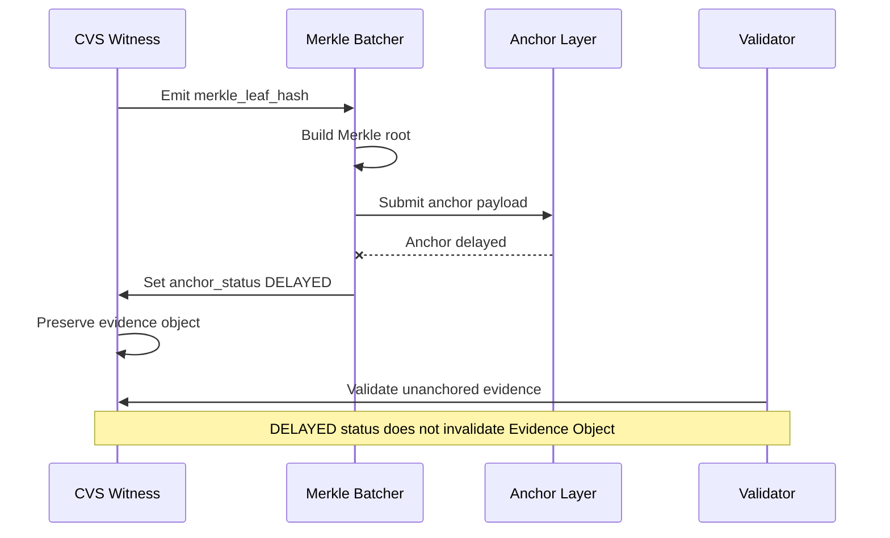

# Sequence Diagrams

## Proposal to Decision to Evidence

---

## Evaluation-Unavailable DENY — Gate Cannot Evaluate

This sequence models gate-layer failure: the gate itself cannot
evaluate. The infrastructure-failure handler produces DENY —
the commit path remains closed, execution does not proceed, and
the CVS sidecar records the unavailability period as a gap record.

This is distinct from witness-layer failure (see below).

---

## Witness-Layer Failure — Evidence Gap During Normal Execution

This sequence models witness-layer failure: the gate evaluated
correctly and emitted a decision, but the witness cannot write to
storage. Execution is not halted.

---

## Delayed Anchoring

