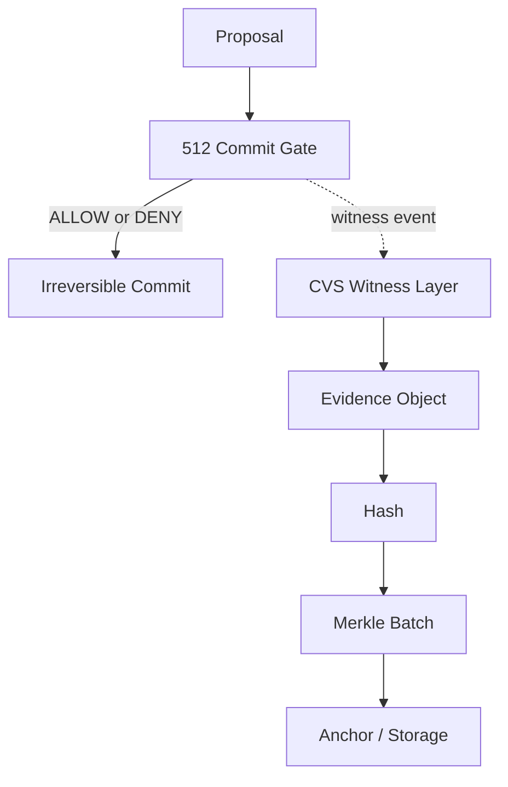
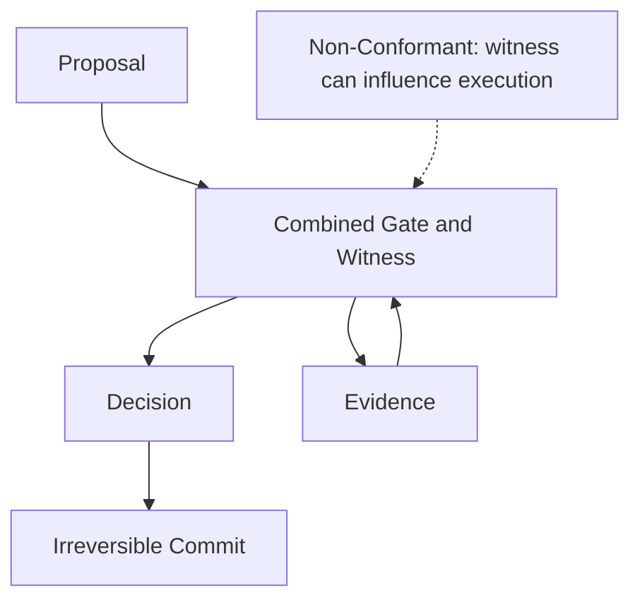
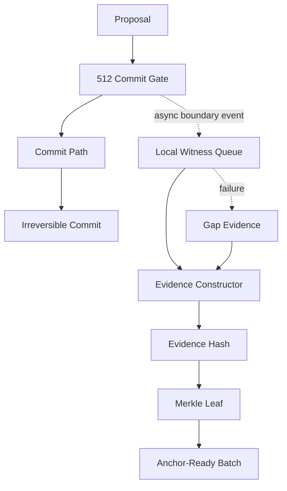

# Topology Diagrams

## Conformant Witness Separation

```mermaid
flowchart TD
    A[Proposal] --> B[512 Commit Gate]
    B -->|ALLOW or DENY| C[Irreversible Commit]
    B -. witness event .-> D[CVS Witness Layer]
    D --> E[Evidence Object]
    E --> F[Hash]
    F --> G[Merkle Batch]
    G --> H[Anchor / Storage]
```

## Non-Conformant Combined Gate and Witness

```mermaid
flowchart TD
    A[Proposal] --> B[Combined Gate and Witness]
    B --> C[Decision]
    B --> D[Evidence]
    D --> B
    C --> E[Irreversible Commit]

    X[Non-Conformant: witness can influence execution] -.-> B
```

## Asynchronous Witness Flow

```mermaid
flowchart TD
    A[Proposal] --> B[512 Commit Gate]
    B --> C[Commit Path]
    C --> D[Irreversible Commit]

    B -. async boundary event .-> E[Local Witness Queue]
    E --> F[Evidence Constructor]
    F --> G[Evidence Hash]
    G --> H[Merkle Leaf]
    H --> I[Anchor-Ready Batch]

    E -. failure .-> J[Gap Evidence]
    J --> F
```
