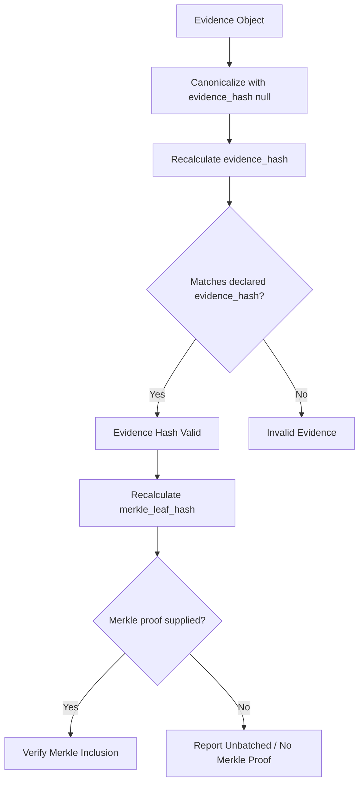
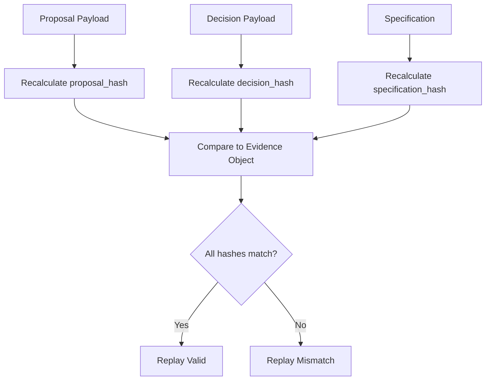

# Validation Diagrams

## Independent Proof Verification

```mermaid
flowchart TD
    A[Evidence Object] --> B[Canonicalize with evidence_hash null]
    B --> C[Recalculate evidence_hash]
    C --> D{Matches declared evidence_hash?}
    D -->|Yes| E[Evidence Hash Valid]
    D -->|No| F[Invalid Evidence]

    E --> G[Recalculate merkle_leaf_hash]
    G --> H{Merkle proof supplied?}
    H -->|Yes| I[Verify Merkle Inclusion]
    H -->|No| J[Report Unbatched / No Merkle Proof]
```

## Replay Verification

```mermaid
flowchart TD
    A[Proposal Payload] --> B[Recalculate proposal_hash]
    C[Decision Payload] --> D[Recalculate decision_hash]
    E[Specification] --> F[Recalculate specification_hash]

    B --> G[Compare to Evidence Object]
    D --> G
    F --> G

    G --> H{All hashes match?}
    H -->|Yes| I[Replay Valid]
    H -->|No| J[Replay Mismatch]
```
